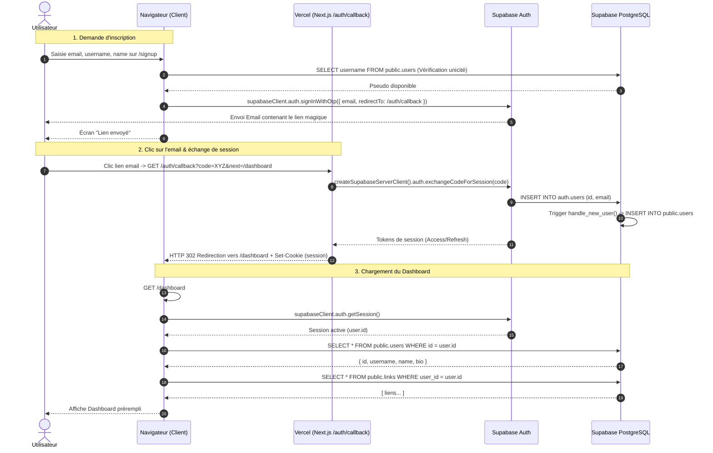

# Workflow Inscription & Validation Magic Link

Ce document décrit le flux complet d'inscription d'un nouvel utilisateur, depuis la saisie du formulaire jusqu'à la création du profil et l'accès au tableau de bord.

---

## 1. Description des étapes

1. **Vérification du pseudo (`/signup`) :**
   - Le client saisit un pseudo (ex: `mialigo.com/mario`).
   - Vérification en temps réel dans `public.users` pour s'assurer de sa disponibilité.
2. **Demande de Magic Link :**
   - Le client envoie son email et ses métadonnées (`username`, `name`).
   - Supabase Auth génère un jeton sécurisé et expédie l'email avec un lien pointant vers `/auth/callback?next=/dashboard`.
3. **Validation & Création de session (`/auth/callback`) :**
   - Au clic sur le lien dans l'email, le serveur Next.js intercepte le `code` ou `token_hash`.
   - Échange avec Supabase pour créer la session et enregistrer les cookies HTTP sécurisés.
   - Création / synchronisation du profil dans `public.users`.
4. **Accès au Dashboard (`/dashboard`) :**
   - Redirection vers le tableau de bord avec les données utilisateur pré-remplies.

---

## 2. Diagramme de Séquence UML

---

## 3. Logs de diagnostic associés

- `[Signup] 🔍 Vérification de la disponibilité du pseudo: "<pseudo>"`
- `[Signup] ✅ Pseudo "<pseudo>" DISPONIBLE.` / `[Signup] ⚠️ Pseudo "<pseudo>" DÉJÀ PRIS`
- `[Signup] 🚀 Tentative d'inscription: { email, username, name }`
- `[Signup] ✅ Magic link d'inscription envoyé avec succès à: "<email>"`
- `[Auth/Callback] 📥 Requête reçue: { hasCode, hasTokenHash, next }`
- `[Auth/Callback] ✅ Session PKCE échangée avec succès: { id, email }`
- `[Auth/Callback] ✅ Profil public.users créé pour "<pseudo>"`
