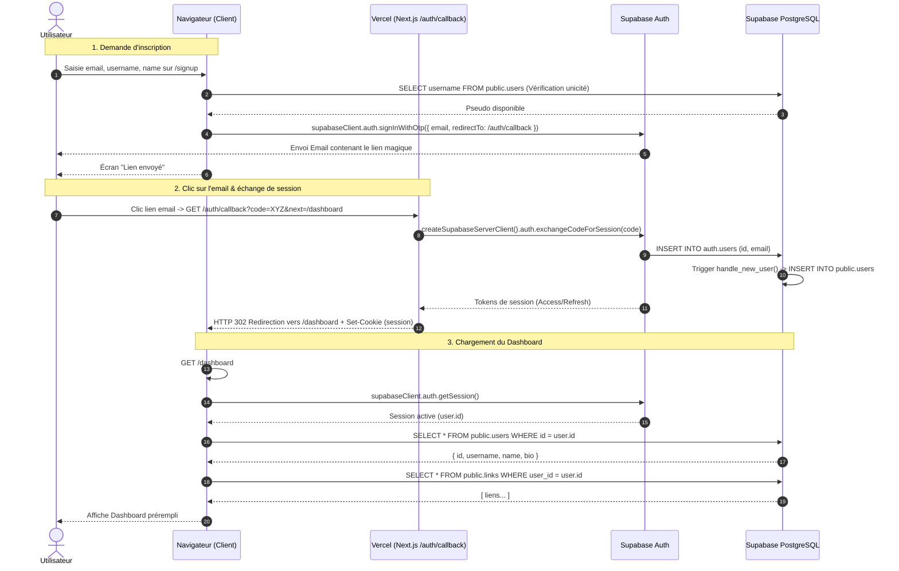
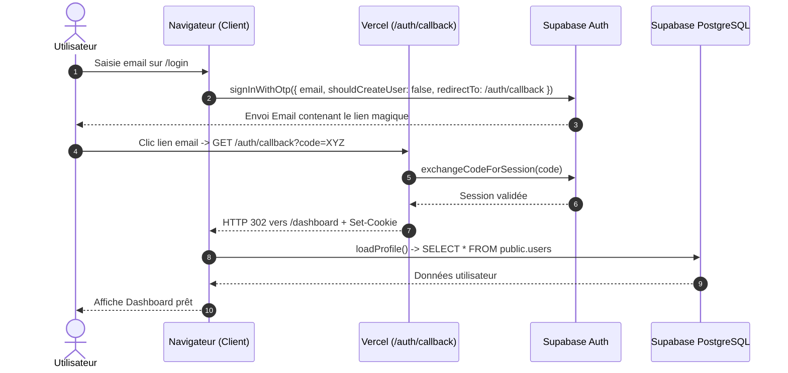
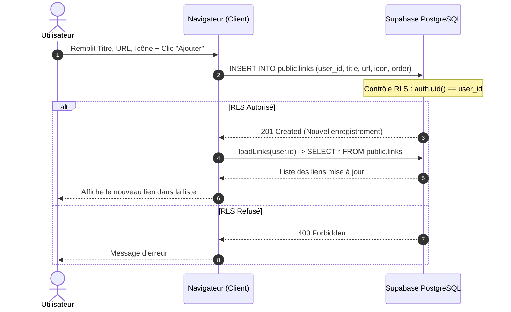

Voici l'explication complète et détaillée de l'architecture, suivie de l'analyse des anomalies observées (dashboard vide, utilisateur manquant en BDD, synchronisation dark mode) et des diagrammes de séquence UML.

---

## 1. Pourquoi le Dashboard était vide et l'utilisateur absent en BDD ?

1. **La séparation entre `auth.users` et `public.users` :**
   - **`auth.users` (Géré par Supabase)** : stocke l'email, l'ID d'authentification et les tokens de connexion.
   - **`public.users` (Votre table métier)** : stocke `username`, `name`, `bio`.
2. **Ce qui s'est passé :**
   - Le lien magique a validé la session dans `auth.users`, mais **la ligne dans `public.users` n'a pas été insérée**.
   - Causes fréquentes :
     - Soit le trigger PostgreSQL `on_auth_user_created` défini dans `supabase-auth-clean.sql:33-52` n'a pas été réexécuté / activé dans le dashboard Supabase SQL.
     - Soit le trigger a échoué (par exemple conflit sur un username déjà existant).
   - Dans `page.tsx:70-86`, `loadProfile()` fait `select("*").eq("id", userId).single()` : comme aucune ligne n'existe dans `public.users`, `data` est nul et les champs restent vides.

---

## 2. Pourquoi le Dark Mode ne change pas partout ?

- Le thème est stocké dans le `localStorage` du navigateur via `theme-toggle.tsx:8-38`.
- Le `localStorage` est **isolé par navigateur et appareil** :
  - Si vous changez de fenêtre ou d'onglet sur le **même navigateur**, l'événement `window.addEventListener("storage", ...)` répercute le changement.
  - Si vous ouvrez une **fenêtre de navigation privée**, un **autre navigateur** (ex: Edge vs Chrome), ou votre **smartphone**, le `localStorage` n'est pas partagé (c'est le comportement standard du web).

---

## 3. Rôles respectifs de chaque acteur

| Acteur                          | Rôle principal                                                                                                                                      |
| :------------------------------ | :-------------------------------------------------------------------------------------------------------------------------------------------------- |
| **Navigateur Client**           | Affiche l'UI (React Client Components), capture les saisies, stocke le thème (`localStorage`) et la session (`cookies` / Supabase auth client).     |
| **Vercel (Next.js App Router)** | Exécute les Server Components, sert les pages HTML, et traite le callback d'authentification serveur dans `GET /auth/callback` via `route.ts:4-35`. |
| **Supabase Auth**               | Génère les jetons OTP / liens magiques, envoie les emails, valide les tokens de session et gère `auth.users`.                                       |
| **Supabase PostgreSQL**         | Stocke les données de profils (`public.users`) et de liens (`public.links`), applique les règles de sécurité RLS et exécute les triggers SQL.       |

---

## 4. Workflows détaillés et Diagrammes UML

### Workflow A : Inscription (`/signup`) & Validation Magic Link

---

### Workflow B : Connexion d'un utilisateur existant (`/login`)

---

### Workflow C : Création / Édition de liens sur le Dashboard

---

## 5. Fonctions du code impliquées à chaque étape

1. **Vérification et demande de lien :**
   - `page.tsx:68-105` : `handleSignup()` appelle `supabaseClient.auth.signInWithOtp()`.
   - `page.tsx:32-73` : `handleMagicLink()` appelle `supabaseClient.auth.signInWithOtp()`.
2. **Validation côté serveur :**
   - `route.ts:4-35` : `GET()` intercepte le `code` ou `token_hash`, appelle `createSupabaseServerClient().auth.exchangeCodeForSession(code)` et positionne les cookies HTTP sécurisés.
3. **Trigger BDD automatique :**
   - `supabase-auth-clean.sql:33-52` : `handle_new_user()` déclenché par `AFTER INSERT ON auth.users`.
4. **Lecture & écriture des données utilisateur :**
   - `page.tsx:53-125` : `checkUser()`, `loadProfile()`, `loadLinks()`, `handleSaveProfile()`, `handleAddLink()`.
5. **Rendu de la page publique :**
   - [app/[username]/page.tsx](../app/[username]/page.tsx#L19-L55) : `UserPage()` (Server Component) lit `users` et `links` puis passe les props à `UserPageClient` ([app/[username]/user-page-client.tsx](../app/[username]/user-page-client.tsx)).

Created 3 todos
