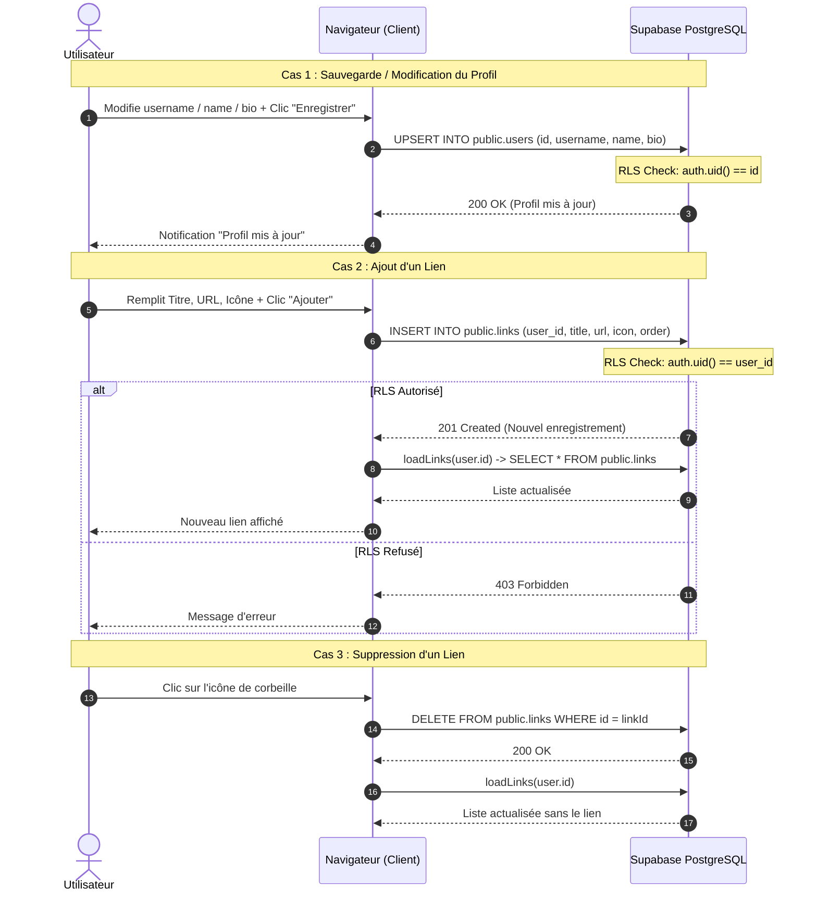

# Workflow Gestion des Liens & Profil Dashboard

Ce document décrit le cycle de vie des données (création, mise à jour, suppression de liens et édition du profil) depuis l'interface d'administration `/dashboard`.

---

## 1. Description des actions

1. **Mise à jour du profil :**
   - L'utilisateur met à jour son `username`, `name` ou `bio`.
   - La requête utilise `upsert` avec vérification RLS (`auth.uid() = id`).
2. **Ajout d'un nouveau lien :**
   - L'utilisateur sélectionne un titre, une URL et une icône de réseau social.
   - Insertion dans `public.links` avec calcul automatique de l'ordre d'affichage.
3. **Édition / Suppression d'un lien :**
   - Modification directe ou suppression sécurisée protégée par RLS (`auth.uid() = user_id`).

---

## 2. Diagramme de Séquence UML

---

## 3. Logs de diagnostic associés

- `[Dashboard] 💾 Sauvegarde du profil... { id, username, name, bio }`
- `[Dashboard] ✅ Profil sauvegardé / mis à jour avec succès.`
- `[Dashboard] ➕ Ajout d'un nouveau lien... { title, url, icon, order }`
- `[Dashboard] ✅ Lien ajouté avec succès.`
- `[Dashboard] 🗑️ Suppression du lien ID: "<linkId>"`
- `[Dashboard] 💾 Mise à jour du lien ID: "<linkId>"`
