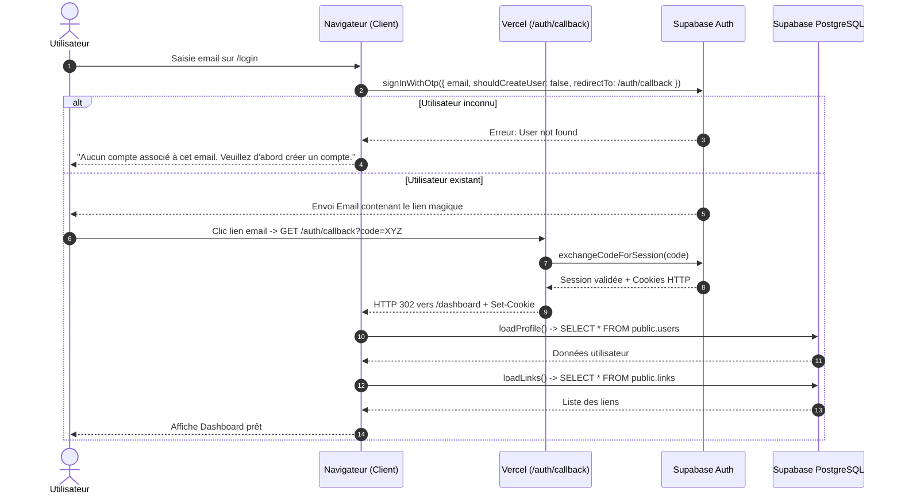

# Workflow Connexion Utilisateur Existant (`/login`)

Ce document décrit le flux de connexion pour un utilisateur déjà inscrit, utilisant l'envoi d'un lien magique sécurisé sans mot de passe.

---

## 1. Description des étapes

1. **Saisie de l'email (`/login`) :**
   - L'utilisateur renseigne uniquement son adresse email.
   - `signInWithOtp` est appelé avec `shouldCreateUser: false` pour interdire la création d'un compte fantôme sans pseudo.
2. **Génération et expédition du lien magique :**
   - Supabase Auth vérifie l'existence de l'utilisateur.
   - Si l'utilisateur n'existe pas, un message d'erreur invite l'utilisateur à créer son compte via `/signup`.
   - Si l'utilisateur existe, l'email est envoyé avec le lien de redirection vers `/auth/callback?next=/dashboard`.
3. **Validation & Initialisation de la session (`/auth/callback`) :**
   - Le lien est cliqué sur n'importe quel navigateur / appareil.
   - La route serveur échange le jeton et pose les cookies sécurisés.
4. **Redirection vers le Dashboard (`/dashboard`) :**
   - Les données et liens de l'utilisateur sont immédiatement chargés.

---

## 2. Diagramme de Séquence UML

---

## 3. Logs de diagnostic associés

- `[Login] 🔍 Vérification de la session active...`
- `[Login] 🚀 Demande de lien magique pour l'email: "<email>"`
- `[Login] ✅ Magic link de connexion envoyé avec succès à "<email>"`
- `[Login] ⚠️ Utilisateur non trouvé pour "<email>". Doit passer par /signup.`
- `[Auth/Callback] ✅ Session PKCE échangée avec succès: { id, email }`
